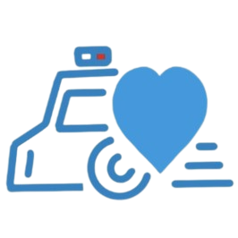

# 心身同调·全维健康 Pro Web 前端 🌟

LifeSync · Holistic Health Pro Web Frontend

<p align="center">
  
</p>

<p align="center">
  <a href="#项目简介">简介</a> •
  <a href="#核心功能">功能</a> •
  <a href="#快速开始">快速开始</a> •
  <a href="#技术架构">架构</a> •
  <a href="#页面说明">页面</a> •
  <a href="#贡献指南">贡献</a>
</p>

## 📖 项目简介

心身同调·全维健康是一款创新的健康管理平台的 Web 前端项目，为用户提供直观、易用的健康数据可视化和管理界面。通过现代化的 UI 设计和流畅的交互体验，帮助用户更好地了解和管理自己的健康状况。

## 🚀 核心功能

- 📊 **健康数据管理**

  - 体重、血压、心率等健康指标记录
  - 数据可视化图表展示
  - 健康趋势分析
  - 智能建议生成

- 🧠 **心理健康管理**

  - 心情记录与分析
  - 情绪趋势追踪
  - AI 心理建议
  - 心路笔记功能

- 🔄 **设备管理**

  - 智能设备绑定
  - 数据自动同步
  - 设备状态监控
  - 多设备协同

- 👤 **用户中心**
  - 个人资料管理
  - 主题切换
  - 隐私设置
  - 数据导出

## 💻 技术栈

### 核心框架

- ⚛️ **Next.js 14** - React 框架,支持 SSR/SSG
- 🔷 **TypeScript** - 类型安全的 JavaScript 超集
- 🎨 **Tailwind CSS** - 原子化 CSS 框架
- 📊 **Recharts** - 响应式图表库

### UI 组件

- 🎨 **Geist UI** - 现代化组件库
- 🎨 **Lucide React** - 图标库
- 🌙 **next-themes** - 主题切换

### 开发工具

- 📝 **ESLint** - 代码检查
- 🎨 **Prettier** - 代码格式化
- 🔍 **TypeScript** - 静态类型检查

## ⚙️ 系统要求

- Node.js >= 18
- Bun >= 1.0.0 (推荐)

## 🚀 快速开始

### 1. 克隆项目

```bash
git clone https://gitee.com/zeroicey/life-sync-health-web.git
cd life-sync-health-web
```

### 2. 安装依赖

```bash
bun install
# 或
npm install
```

### 3. 环境配置

编辑 src/lib/api-client.ts 文件：

```typescript
const API_URL = process.env.NEXT_PUBLIC_API_URL || "http://localhost:3000/api";
```

### 4. 启动开发服务器

```bash
bun dev
# 或
npm run dev
```

访问 [http://localhost:3000](http://localhost:3000) 查看应用。

## 📱 页面说明

### 主要页面

- `/` - 首页/登录注册
- `/dashboard` - 用户仪表盘
- `/health` - 健康数据管理
- `/mood` - 心情记录
- `/memo` - 心路笔记
- `/devices` - 设备管理

### 功能页面

- `/auth/login` - 登录
- `/auth/register` - 注册
- `/contact` - 联系我们
- `/docs` - 使用文档
- `/license` - 许可证
- `/sponsor` - 支持项目

## 📁 项目结构

```
life-sync-health-web/
├── src/
│   ├── app/                 # 页面组件
│   │   ├── auth/           # 认证相关页面
│   │   ├── dashboard/      # 仪表盘
│   │   ├── health/         # 健康数据
│   │   ├── mood/           # 心情记录
│   │   ├── memo/           # 心路笔记
│   │   └── devices/        # 设备管理
│   ├── components/         # 通用组件
│   │   ├── auth/          # 认证组件
│   │   ├── common/        # 公共组件
│   │   ├── health/        # 健康相关组件
│   │   ├── mood/          # 心情相关组件
│   │   └── layout/        # 布局组件
│   ├── contexts/          # 上下文
│   ├── lib/              # 工具函数
│   ├── services/         # API 服务
│   └── styles/           # 样式文件
├── public/               # 静态资源
└── package.json
```

## 👥 开发团队

### ACACIA 团队

- 👨‍💻 **张开鑫** - 全栈开发
- 👨‍💻 **汪宁** - 文档编写
- 👨‍💻 **郭嘉荣** - 代码测试

### 指导老师

- 👨‍🏫 **欧凯曈**
- 👨‍🏫 **李伟梁**

## 🔗 相关项目

- 🌐 [后端 API](https://gitee.com/zeroicey/life-sync-health-api.git)
- 🤖 [AI 服务](https://gitee.com/zeroicey/life-sync-health-ai.git)

## 📄 许可证

版权所有 © 2024 ACACIA 团队

本项目采用修改版 MIT 许可证。详见 [LICENSE](LICENSE) 文件。

## 📞 联系我们

- Email: zeroicey.hp@outlook.com
- Wechat: Y3245632373

---

<p align="center">用科技守护健康，用数据改善生活 ❤️</p>
